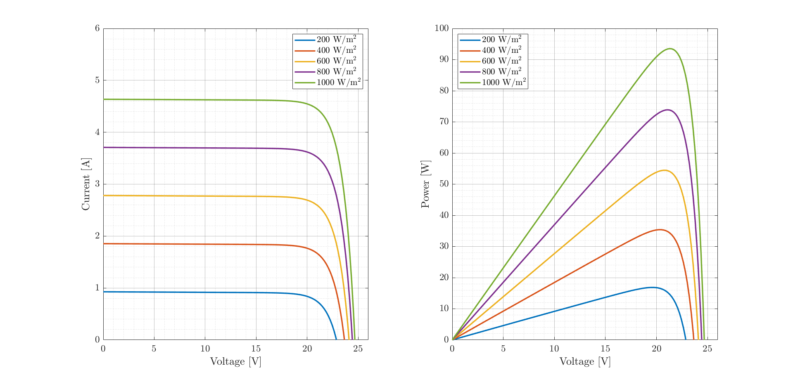
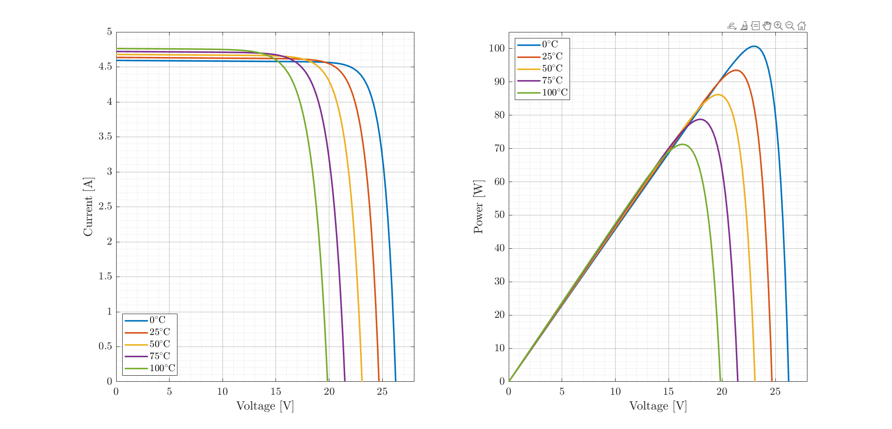
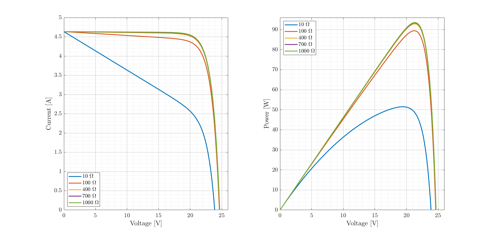
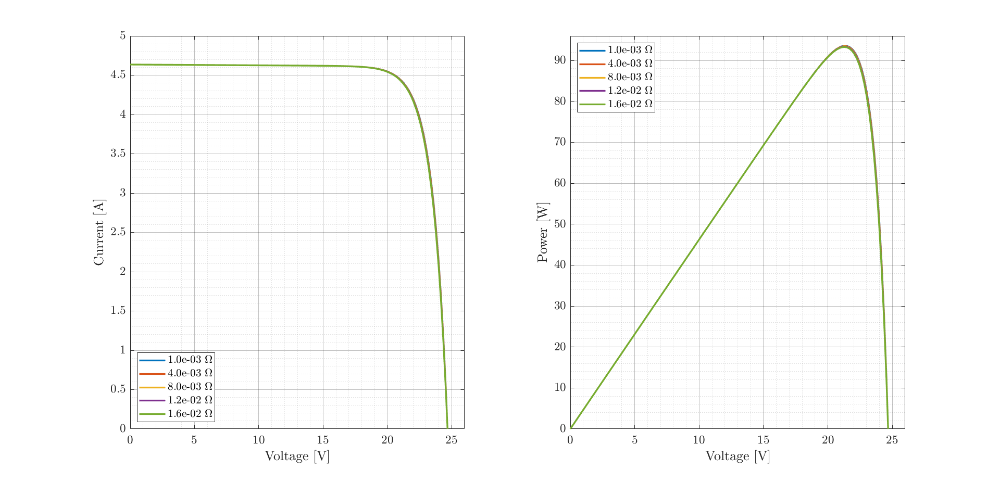
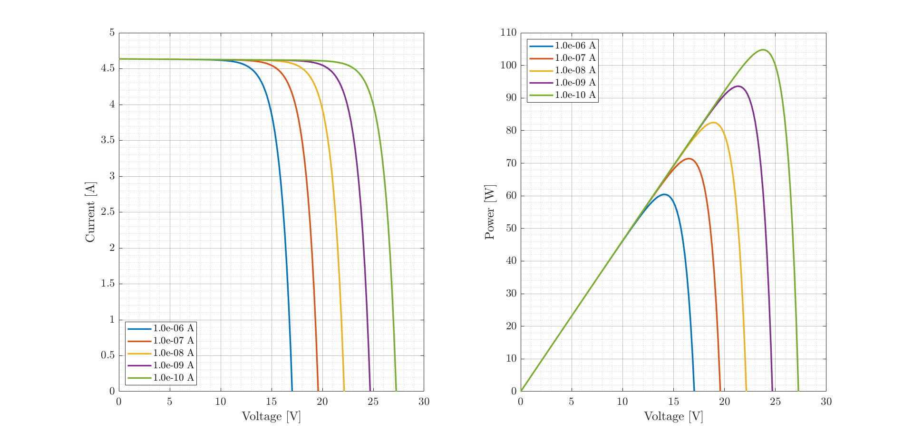

<div align="center">

# Photovoltaic I–V and P–V Curve Analysis
</div>

This repository contains MATLAB and Python codes for the simulation and analysis
of photovoltaic I–V and P–V curves under varying irradiance and temperature conditions.

| [](Figures/G.png) | [](Figures/T.png) | [](Figures/Rsh.png) |
| ----------------------------------------------------------------------------------------------------------------------------------------- | ----------------------------------------------------------------------------------------------------------------------------------------- | ------------------------------------------------------------------------------------------------------------------------------------- |
| [](Figures/Rs.png)                                              | [](Figures/Is.png)                                     |                                                                                                                                       |


The models are intended to support research on solar energy harvesting in
aerospace and bioinspired applications, including flapping-wing UAVs.

## Repository contents

- `/MATLAB/`  
  MATLAB script for I–V and P–V curve generation

- `/Figures/`  
  Example simulations and plots

## Corresponding authors

- [Vítor D. Marchiori](http://lattes.cnpq.br/5431211572935053)
* [Rodrigo B. Santos](http://lattes.cnpq.br/6783847794438620)
- [Douglas D. Bueno](https://feis.unesp.br/douglasbueno) 

## How to cite

The content is available for non-commercial research under the following terms: (i) GMSINT Group and UNESP Ilha Solteira should be acknowledged as the source of the data; (ii) this repository should be cited as follows:

> Marchiori, V. D.; Santos, R. B.; Bueno, D. D. (2025). *Photovoltaic I-V and P-V Curve Analysis*. GitHub, https://github.com/vitordmarchiori/Photovoltaic-IV-PV-Analysis.

### BibTeX

If you are using a LaTeX Editor, you can cite this repository using these BibTeX citations:

```bibtex
@misc{marchiori2025,
  author       = {Marchiori, Vítor D. and Santos, Rodrigo B. and Bueno, Douglas D.},
  title        = {Photovoltaic I--V and P--V Curve Analysis},
  year         = {2025},
  howpublished = {\url{https://github.com/vitordmarchiori/Photovoltaic-IV-PV-Analysis}},
  note         = {[Simulation codes]. GitHub}
}
```

## Funding
São Paulo Research Foundation, [FAPESP](https://fapesp.br/en), Grant number 2023/15904-4.


## License
Creative Commons Attribution-NonCommercial-ShareAlike (CC-BY-NC-SA): A creative commons license that bans commercial use and requires you to release any modified works under this license.
